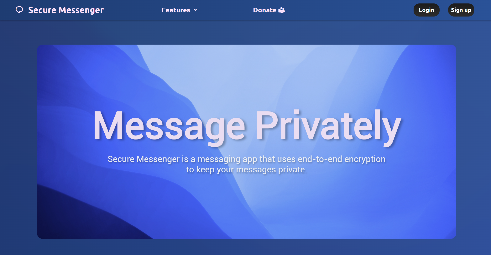

# Secure Messenger


## 📝 Table of Contents

- [Overview](#overview)
- [Features](#features)
  - [User Authentication](#user-authentication)
  - [Real-time Messaging](#real-time-messaging)
  - [Contact Management](#contact-management)
  - [Security Features](#security-features)
  - [UI/UX Features](#uiux-features)
- [Tech Stack](#tech-stack)
  - [Frontend Technologies](#frontend-technologies)
  - [Backend Technologies](#backend-technologies)
  - [Database](#database)
  - [Security Implementation](#security-implementation-technologies)
  - [Development Tools](#development-tools)
- [Security Implementation](#security-implementation)
  - [Why Custom Cryptography?](#why-custom-cryptography)
  - [Custom Cryptography Implementation](#custom-cryptography-implementation)
  - [Two-Layer Encryption Approach](#two-layer-encryption-approach)
  - [Message Security Flow](#message-security-flow)
  - [Key Management](#key-management)
  - [Security Considerations](#security-considerations)
  - [Security Improvement Recommendations](#security-improvement-recommendations)
- [Installation & Setup](#installation--setup)
  - [Prerequisites](#prerequisites)
  - [Detailed Setup Steps](#detailed-setup-steps)
  - [Environment Configuration](#environment-configuration)
  - [Troubleshooting](#troubleshooting)
- [Project Structure](#project-structure)
- [Usage](#usage)
  - [Account Management](#account-management)
  - [Messaging Features](#messaging-features)
  - [Security Features Usage](#security-features-usage)
  - [Best Practices](#best-practices)
- [Scalability](#scalability)
  - [Current Architecture Limitations](#current-architecture-limitations)
  - [Scaling Strategies](#scaling-strategies)
  - [Technology Recommendations for Scale](#technology-recommendations-for-scale)
- [Potential Improvements](#potential-improvements)
  - [Security Enhancements](#security-enhancements)
  - [Feature Expansions](#feature-expansions)
  - [Performance Optimizations](#performance-optimizations)
  - [UI/UX Improvements](#uiux-improvements)
  - [Code Quality Enhancements](#code-quality-enhancements)
- [License](#license)

## Overview

Secure Messenger is a web-based messaging application designed with privacy and security at its core. It implements end-to-end encryption using custom AES and RSA algorithms for educational purposes, ensuring that messages remain confidential and can only be read by the intended recipients.



## Features

### User Authentication

- **Secure Registration System**: Multi-step user registration with email verification
- **Password Security**: Advanced password hashing using bcrypt with salt rounds for enhanced protection
- **Login Attempt Monitoring**: System tracks and limits failed login attempts to prevent brute force attacks
- **Session Management**: Secure session handling with timeout functionality for inactive users
- **Account Recovery**: Email-based account recovery system with verification codes
- **Two-Factor Authentication**: Optional 2FA support for additional security (planned feature)


### Real-time Messaging

- **Instant Message Delivery**: Socket.io-powered real-time communication with minimal latency
- **Read Receipts**: Indicators showing when messages have been delivered and read
- **Typing Indicators**: Real-time notifications when others are typing
- **Message Status**: Visual indicators for message states (sent, delivered, read)
- **Message History**: Complete chat history preservation with search functionality
- **Large File Support**: Ability to send files up to 100MB with progress indicators


### Contact Management

- **Friend Search**: Easy-to-use search functionality to find other users
- **Friend Requests**: Send, accept, or decline friend requests
- **Contact Organization**: Group contacts by categories or favorites
- **Block/Mute Options**: Ability to block or mute specific contacts
- **Presence Information**: See when contacts are online, away, or offline
- **Contact Sync**: Option to sync with phone contacts (future feature)

### Security Features

- **End-to-End Encryption**: All messages encrypted using custom AES-256 algorithm
- **Key Exchange**: Secure RSA-based key exchange mechanism
- **Message Integrity**: Verification that messages haven't been tampered with
- **Self-Destructing Messages**: Option to set messages to delete after being read
- **Secure Data Storage**: All sensitive data stored in encrypted format
- **Transport Layer Security**: HTTPS implementation for secure client-server communication

### UI/UX Features

- **Responsive Design**: Fully responsive interface that works on desktop and mobile devices
- **Dark/Light Mode**: Toggleable interface themes for different lighting conditions
- **Custom Chat Backgrounds**: Personalized chat background options
- **Message Formatting**: Support for basic text formatting (bold, italic, etc.)
- **Emoji Support**: Built-in emoji selector and support
- **Read Position Tracking**: Automatically scrolls to the last read message

## Tech Stack

### Frontend Technologies

- **HTML5/CSS3**: Modern markup and styling with responsive design principles
- **Vanilla JavaScript**: Core language for client-side functionality
- **Socket.io Client**: Real-time communication library for instant messaging
- **CSS Animations**: Smooth transitions and loading states
- **LocalStorage/SessionStorage**: Client-side storage for user preferences and caching
- **Fetch API**: Modern approach for HTTP requests

### Backend Technologies

- **Node.js**: JavaScript runtime for building the server application
- **Express**: Web application framework for handling HTTP requests
- **Socket.io**: Server implementation for real-time bidirectional communication
- **bcrypt**: Password hashing library for secure credential storage
- **Express Session**: Session management middleware
- **MySQL2**: MySQL client for Node.js with improved performance
- **Nodemon**: Development tool for automatically restarting the server during development
- **CORS**: Cross-Origin Resource Sharing middleware for secure API access

### Database

- **MySQL**: Relational database management system for structured data storage
- **Entity-Relationship Model**: Carefully designed schema for efficient data relationships
- **Stored Procedures**: Pre-compiled SQL statements for improved security and performance
- **Database Indexes**: Optimized query performance with strategic index placement
- **Connection Pooling**: Efficient management of database connections
- **Data Normalization**: Third normal form implementation for data integrity

### Security Implementation Technologies

- **Custom AES Implementation**: Educational implementation of AES encryption algorithm
- **Custom RSA Implementation**: Educational RSA implementation for key exchange
- **Child Process Module**: Node.js module for executing Python cryptography scripts
- **MySQL Secure Authentication**: Secure database access with prepared statements
- **Express Rate Limiting**: Prevention of brute force and DoS attacks
- **Content Security Policy**: Browser security feature to prevent XSS attacks

### Development Tools

- **Git/GitHub**: Version control for collaborative development
- **Visual Studio Code**: Primary integrated development environment
- **Chrome DevTools**: Browser-based debugging and performance analysis
- **Postman**: API testing and documentation
- **MySQL Workbench**: Database design and management tool
- **Python**: Used for cryptographic operations
- **npm**: Package management for Node.js dependencies

## Security Implementation

### Why Custom Cryptography?

The implementation of custom cryptographic algorithms in this project serves a **strictly educational purpose**. It's important to emphasize that:

- **Production Systems Should Use Established Libraries**: In real-world applications, using well-vetted cryptographic libraries like OpenSSL, libsodium, or Web Crypto API is strongly recommended.
  
- **Educational Value**: Custom implementation provides insights into:
  - Core principles of symmetric and asymmetric encryption
  - Mathematical foundations of cryptographic algorithms
  - Practical challenges in secure key management
  - Performance considerations in encryption operations

- **Security Limitations**: Our custom implementations:
  - Have not undergone security audits
  - May contain vulnerabilities not present in established libraries
  - Lack optimizations found in professional implementations
  - Do not implement countermeasures against side-channel attacks

- **Industry Best Practice**: The gold standard remains "don't implement your own crypto" - this project intentionally breaks this rule for learning purposes only.

### Custom Cryptography Implementation

#### AES Implementation

- **Algorithm**: AES (Advanced Encryption Standard) with 128-bit key length
- **Mode of Operation**: Electronic Codebook (ECB) for simplicity
- **Key Generation**: Random 16-byte keys generated during account creation
- **Implementation Details**:
  - Custom S-box transformation
  - ShiftRows, MixColumns, and AddRoundKey operations
  - 10 rounds of transformation as per AES-128 specification
  - Python implementation for educational clarity

#### RSA Implementation

- **Key Generation**: Custom implementation using:
  - Cryptographically secure random number generation
  - Miller-Rabin primality testing
  - Extended Euclidean algorithm for modular inverse calculation
- **Key Length**: 1024-bit RSA keys (can be adjusted)
- **Operations**: Supporting encryption, decryption, signing, and verification
- **Padding**: Basic padding scheme for security (not OAEP)

### Two-Layer Encryption Approach

The system implements a dual-layer encryption strategy:

1. **Inner Layer (AES)**: 
   - Symmetric encryption of message content
   - Unique AES key for each user
   - Fast encryption/decryption of message contents

2. **Outer Layer (RSA)**:
   - Public-key encryption for key exchange
   - Protection of AES keys during transmission
   - Asymmetric approach for secure key distribution

This approach combines the speed benefits of symmetric encryption with the key distribution advantages of asymmetric systems.

### Message Security Flow

1. **Registration Phase**:
   - Generate unique AES key for user
   - Generate RSA key pair for secure communications
   - Store keys in secure database

2. **Message Sending**:
   - User composes message
   - Message encrypted with sender's AES key
   - Encrypted message transmitted via WebSockets
   
3. **Message Receipt**:
   - Recipient receives encrypted message
   - System retrieves appropriate AES key
   - Message decrypted only on recipient's end

4. **Key Exchange** (for future direct messaging):
   - Sender encrypts AES session key with recipient's public RSA key
   - Encrypted key sent alongside message
   - Recipient decrypts session key using private RSA key
   - Session key used for subsequent message decryption

### Key Management

- **Key Storage**: 
  - User keys stored in dedicated table with access controls
  - Private keys should never leave the server (future improvement)
  
- **Key Generation**:
  - Random key generation using cryptographically secure methods
  - Unique keys per user to compartmentalize compromise risk

- **Key Rotation**:
  - Periodic key rotation (planned feature)
  - Automatic re-encryption of message history with new keys

### Security Considerations

The current implementation has several educational aspects and would require enhancements for production use:

- **ECB Mode Limitations**: The ECB mode doesn't hide data patterns effectively
- **Key Transportation**: Keys should be better protected during transmission
- **Storage Security**: Database encryption should be added
- **Authentication**: Message authentication codes should be implemented
- **Perfect Forward Secrecy**: Currently not implemented but recommended

### Security Improvement Recommendations

For a production environment, consider these security enhancements:

- **Replace Custom Crypto**: Use established libraries like crypto-js, node-forge, or Web Crypto API
- **Implement GCM Mode**: Replace ECB with AES-GCM for authenticated encryption
- **Add Message Authentication**: Implement HMAC or similar for message integrity
- **Improve Key Management**: Use HSM or secure key management services
- **Perfect Forward Secrecy**: Implement ephemeral key exchanges using Diffie-Hellman
- **End-to-End Verification**: Add message signing and verification
- **Transport Security**: Ensure all connections use TLS 1.3
- **Security Headers**: Implement CSP, HSTS, and other security headers
- **Regular Security Audits**: Conduct penetration testing and code reviews

## Installation & Setup

### Prerequisites

- **Node.js**: v14.0.0 or higher
- **MySQL**: v8.0 or higher
- **Python**: v3.8 or higher with sympy module installed
- **Web Browser**: Modern browser with WebSocket support
- **Operating System**: Windows, macOS, or Linux

### Detailed Setup Steps

#### 1. Database Setup

```bash
# Login to MySQL
mysql -u root -p

# Create database
CREATE DATABASE securemessenger;

# Create database user (optional but recommended)
CREATE USER 'secureapp'@'localhost' IDENTIFIED BY 'your_strong_password';
GRANT ALL PRIVILEGES ON securemessenger.* TO 'secureapp'@'localhost';
FLUSH PRIVILEGES;
```

Execute the schema creation script:

```bash
mysql -u root -p securemessenger < content/createtables.sql
```

#### 2. Clone Repository

```bash
git clone https://github.com/yourusername/secure-messenger.git
cd secure-messenger
```

#### 3. Install Dependencies

```bash
# Install Node.js dependencies
cd nodeServer
npm install

# Install Python dependencies
pip install sympy
```

#### 4. Configure Environment

Create a `.env` file in the nodeServer directory:

```
DB_HOST=localhost
DB_USER=secureapp
DB_PASSWORD=your_strong_password
DB_DATABASE=securemessenger
SERVER_PORT=8000
CLIENT_ORIGIN=http://127.0.0.1:5500
```

#### 5. Run the Application

```bash
# Start the Node.js server
cd nodeServer
npm start

# Serve the frontend (using VS Code Live Server or similar)
# Open public/index.html in your browser
```

### Environment Configuration

#### Development Environment

- Use `nodemon` for automatic server restarts during development
- Enable detailed logging for debugging
- Consider using a test database

```bash
npm run dev
```

#### Production Environment

- Set appropriate environment variables for production
- Configure a reverse proxy (Nginx/Apache) in front of the Node.js server
- Enable security headers and HTTPS

```bash
NODE_ENV=production npm start
```

### Troubleshooting

- **Database Connection Issues**:
  - Verify MySQL service is running
  - Check credentials in .env file
  - Ensure database and tables exist

- **Node.js Errors**:
  - Delete node_modules and run npm install again
  - Check for compatibility between Node.js version and dependencies

- **Socket Connection Problems**:
  - Verify CORS settings match your client origin
  - Check for firewall or proxy blocking WebSocket connections

- **Encryption Errors**:
  - Ensure Python is in your PATH
  - Verify sympy module is installed
  - Check file paths in encryption scripts

## Project Structure

```
secure-messenger/
├── nodeServer/              # Server-side code
│   ├── index.js             # Main server entry point
│   └── package.json         # Node.js dependencies
├── public/                  # Client-side code
│   ├── css/                 # Stylesheets
│   ├── js/                  # Client-side JavaScript
│   ├── index.html           # Landing page
│   ├── login.html           # Authentication page
│   └── main.html            # Main application page
├── security/                # Encryption utilities
│   ├── aes_encrypt_optim.py # AES encryption script
│   ├── aes_decrypt.py       # AES decryption script
│   ├── generate_rsa_keys.py # RSA key generation script
│   ├── rsa_encryption.py    # RSA encryption script
│   └── rsa_decryption.py    # RSA decryption script
├── content/                 # Configuration and documentation
│   └── createtables.sql     # Database schema
└── README.md                # Project documentation
```

## Usage

### Account Management

#### Creating an Account

1. Navigate to the login page
2. Click the "Sign Up" button
3. Fill in required fields:
   - Username (must be unique)
   - Valid email address
   - Strong password (minimum 8 characters with mixed case, numbers and symbols)
4. Confirm password
5. Submit the form
6. Account will be created along with encryption keys


#### Logging In

1. Enter your username
2. Enter your password
3. Click "Login"
4. System will authenticate credentials and establish a secure session
5. Failed login attempts are monitored and limited

#### Account Security Best Practices

- Use a strong, unique password
- Don't share your login credentials
- Log out when using shared computers
- Check your message history periodically for unauthorized access

### Messaging Features

#### Sending Messages

1. Select a contact from the sidebar
2. Type your message in the input field
3. Press Enter or click Send
4. Message will be encrypted and sent in real-time

#### Reading Messages

1. Click on a conversation in the sidebar
2. View the message history
3. Encrypted messages are automatically decrypted for display
4. Status indicators show if messages were delivered/read

#### Friend Management

1. Use the search box to find users by username
2. Click on a search result to add as a friend
3. Friends will appear in your contacts list
4. Select a friend to start a conversation

### Security Features Usage

#### Understanding Encryption Indicators

- Green lock icon: End-to-end encrypted message
- Yellow lock icon: Transport encrypted only
- Red icon: Potential security issue

#### Verifying Security

1. Click on conversation options
2. Select "View Security Details"
3. Verify encryption keys match with your contact

### Best Practices

- Verify recipient identity before sending sensitive information
- Regularly update your application to the latest version
- Review connected devices periodically
- Report suspicious activity immediately

## Scalability

### Current Architecture Limitations

The present implementation has several scaling constraints:

- **Single Server**: All socket connections and processing on one server
- **In-Memory User Tracking**: User-to-socket mappings stored in memory
- **Direct Database Connections**: No connection pooling or query caching
- **Python Process Execution**: Spawning Python processes for encryption is resource-intensive
- **Local File System Dependency**: Relies on local files for key operations

### Scaling Strategies

To support larger user bases, the following strategies should be implemented:

1. **Horizontal Scaling**:
   - Deploy multiple server instances behind a load balancer
   - Implement sticky sessions or session store for socket connections
   - Use Redis for shared state management across instances

2. **Database Optimization**:
   - Implement read replicas for scaling read operations
   - Consider database sharding for large user bases
   - Optimize queries and add appropriate indexes

3. **Architectural Improvements**:
   - Move to a microservices architecture
   - Separate authentication, messaging, and encryption services
   - Implement message queuing for asynchronous processing

### Technology Recommendations for Scale

For applications targeting millions of users:

- **Replacement Technologies**:
  - Replace Socket.io with native WebSockets for reduced overhead
  - Migrate from MySQL to PostgreSQL or consider NoSQL options for specific data
  - Replace Python subprocess calls with native Node.js crypto libraries

- **Additional Components**:
  - **Redis**: For session storage, caching, and pub/sub messaging
  - **Kafka**: For message queuing and event streaming
  - **Elasticsearch**: For efficient message searching
  - **AWS KMS/HashiCorp Vault**: For secure key management
  - **Docker & Kubernetes**: For containerization and orchestration
  - **NGINX**: For load balancing and SSL termination
  - **Prometheus & Grafana**: For monitoring and analytics

- **Cloud Services**:
  - Consider managed database services (RDS/Azure SQL)
  - Use auto-scaling groups for dynamic capacity management
  - Implement CDN for static asset delivery
  - Deploy across multiple regions for global availability

## Potential Improvements

### Security Enhancements

- **Professional Cryptography Libraries**: Replace custom implementations with industry-standard libraries
- **End-to-End Encryption Improvements**:
  - Implement the Signal Protocol for perfect forward secrecy
  - Add support for quantum-resistant cryptography algorithms
  - Implement certificate pinning for API connections
- **Advanced Authentication**:
  - FIDO2/WebAuthn support for passwordless authentication
  - OAuth integration for third-party authentication
  - Behavioral biometrics for continuous authentication
- **Compliance Features**:
  - GDPR compliance tools (data export/deletion)
  - HIPAA-compliant messaging options
  - Audit logging for security events

### Feature Expansions

- **Rich Media Support**:
  - Voice messages and calls
  - Video calling capabilities
  - Screen sharing functionality
  - Enhanced file sharing with previews
- **Group Messaging Improvements**:
  - Advanced group management features
  - Role-based permissions in groups
  - Threaded replies in group conversations
  - Pinned messages in groups
- **Business Features**:
  - Chatbot integration capabilities
  - API for business integrations
  - Analytics and engagement metrics
  - Customer service workflows

### Performance Optimizations

- **Client-Side Improvements**:
  - Implement progressive web app capabilities
  - Add offline support with message queueing
  - Optimize bundle size with code splitting
  - Implement virtual scrolling for large message histories
- **Backend Optimizations**:
  - Move encryption to WebAssembly for improved performance
  - Implement batch processing for notifications
  - Add caching layers for frequently accessed data
  - Optimize database schema and queries

### UI/UX Improvements

- **Enhanced User Interface**:
  - Complete redesign with modern UI components
  - Customizable themes and layouts
  - Accessibility improvements (WCAG compliance)
  - Responsive design optimizations for all devices
- **User Experience Enhancements**:
  - Message scheduling functionality
  - Enhanced search capabilities
  - Seamless multi-device synchronization
  - Message translation features
  - Improved notification management

### Code Quality Enhancements

- **Architectural Improvements**:
  - Refactor to TypeScript for improved type safety
  - Implement comprehensive unit and integration testing
  - Add continuous integration/continuous deployment
  - Improve code documentation and comments
- **Development Experience**:
  - Create comprehensive API documentation
  - Implement developer tools for plugin creation
  - Add telemetry for error reporting and analytics
  - Establish contribution guidelines for open source development

## License

This project is licensed under the MIT License - see the [LICENSE](LICENSE) file for details.

---

## 🤝 Contributing

Contributions are welcome! Please feel free to submit a Pull Request.

## 📧 Contact

For any questions or suggestions, please open an issue on GitHub or contact the project maintainers.

---

<p align="center">
  Built with ❤️ for secure communications
</p>
